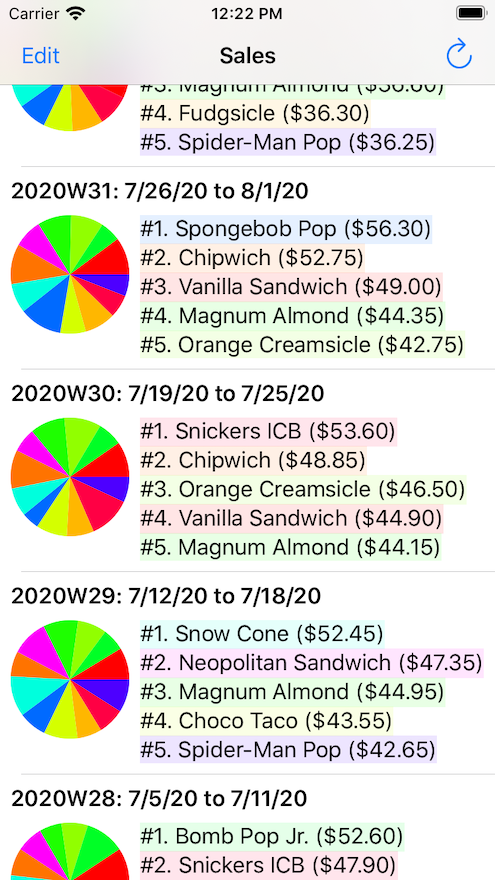

# What is this?

At LogCheck, we believe that peer code review is an important tool that benefits both the quality of our software and the professional growth of our engineers. We have developed this exercise to enable you to demonstrate your ability to read code and provide constructive feedback, just as you would as a member of the LogCheck Engineering team.

# About LogCheck (a real company and app)

LogCheck makes software to support routine maintenance tasks, inspections, and meter readings. Since 2012, building operators have been using our mobile app to log readings, notes, and photos during the regular inspections of their facilities. Everything from the general cleanliness of the 31st floor hallway, to the open-closed status of vents on the roof, to the temperature of a domestic hot water return line in the basement, can be monitored in LogCheck.

We know from experience that our app must be *at least* as easy and flexible as sheets of paper on a clipboard, or else that is the solution our users will return to. If you share our passion for creating usable software that helps people solve problems in the real world, we hope you'll take the time to complete this exercise and apply to work with us at LogCheck!

# About ScoopTrack (a fake company and app)

To keep things simple, we've invented a fake company to be the subject of this exercise.

ScoopTrack is the developer of a mobile app designed to help ice cream truck operators improve operations, grow revenue, and get more business insight. Over the past several years, the app has become popular among ice cream truck operators and has grown from a simple inventory management tool to a comprehensive system for managing a small fleet of ice cream trucks.

Because Swift wasn't around when development of ScoopTrack began, most of its code is written in Objective-C. ScoopTrack makes heavy use of Core Data to persist a local copy of business data, which is synchronized with the ScoopTrack web service.

## The ice cream sales feature

One ScoopTrack feature provides the user with a historical overview of ice cream sales. As users scroll through the table view, they can see which products generated the most revenue on a weekly basis. Each table cell includes a label indicating the week in question, a pie chart of total revenue by product, and a list of the top five products for that week.

Although the feature has been working fairly well, a few of ScoopTrack's customers have complained that the sales review feature has been "acting wonky" lately. This is surprising, because nobody has made any changes to the feature in a long time. Since the complaints are coming from early, loyal customers, the team has decided to evaluate whether any improvements can be made.

As a new member of the ScoopTrack team, you've been asked to review the `SalesTableViewCell` class, make note of any defects, and suggest potential improvements.

# What do you need to do?

1. Read this whole README before you begin.
2. Open [the submission form](https://forms.gle/mmaiexKx9oucAFbj8) in another window.
3. Follow the instructions on the form.

You must use the form to submit your code review comments. If you open a pull request, send email, or submit in any other way your submission will be deleted and ignored.

## Things to keep in mind

In addition to the source code for `SalesTableViewCell`, we've included some header files for you to reference. You do not need to review them, however.

All the code we've provided compiles without errors. We're not asking you to do work the compiler is already doing.

We recognize that, in the real world, you'd have access to all of the app's source code and be able to ask questions of your teammates. If your comments depend on information not available to you, just make an assumption and document it. (For example, "On line 867, we should use `[UIColor blueColor]`, assuming the CEO's favorite color is blue.") This is an imaginary app made by an imaginary company, so as long as your assumptions don't contradict any of the information we've provided, they can't be wrong!

**Please do not spend more than one hour on this exercise!** We're not going to reward or punish you based on the time elapsed, but be aware that [research of code review as a technique][sb] has shown most defects are discovered in the first hour. Moreover, the usefulness of review drops off quickly after that.

[sb]: https://smartbear.com/learn/code-review/best-practices-for-peer-code-review/

**Make your criticism constructive!** Keep in mind that the authors of the code will be reading your comments--you can even address your comments directly to them if you like. Be polite and professional as you point out problems; offer solutions and explanations where you can.
